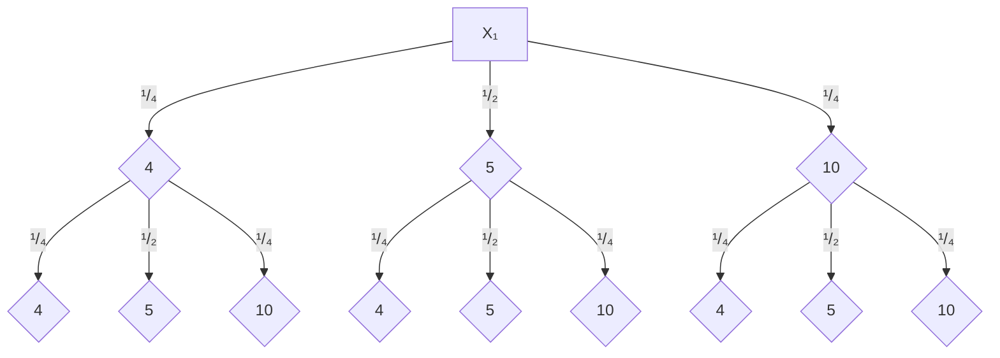

---
{"aliases":null,"tags":["løsningsforslag"],"dg-publish":true,"title":null,"date":"2023-12-06","modified":"2024-05-15","disabled rules":["format-tags-in-yaml","format-yaml-array","insert-yaml-attributes","move-tags-to-yaml","remove-yaml-keys","yaml-key-sort","file-name-heading","yaml-title"],"geometry":"margin=3cm","fontsize":"11pt","papersize":"a4","author":"Ståle Gjelsten","linestretch":1.25,"lang":"nb-NO","header-includes":["\\usepackage{mathtools,cancel,tgpagella,mathpazo,icomma,siunitx}","\\sisetup{output-decimal-marker = {,}}"],"fag":["s2"],"eksamen":"h23","permalink":"/losningsforslag/losningsforslag-s2-eksamen-h2023/","dgPassFrontmatter":true}
---

**

## Oppgave 1-1
Dette integralet trenger ingen spesielle regler eller teknikker for å løses.

$$
\int_{-1}^{1} \left( x^{3}+2x \right)  \, dx = \left[ \frac{1}{4}x^{4}+\frac{2}{2}x^{2} \right]_{-1}^{1}
$$

Jeg setter inn grensene og får

$$
\left( \frac{1}{4}1^{4}+1^{2} \right) - \left( \frac{1}{4}(-1)^{4}+(-1)^{2} \right)=\underline{\underline{0}} 
$$

## Oppgave 1-2 
### 1-2a
Jeg bruker formelen for uendelig geometrisk rekke. Jeg setter inn kjente verdier for å bestemme $k$:

$$
\frac{a_{1}}{1-k}=\frac{4}{1-k}=8 \iff \frac{4}{8}=1-k \iff k=\frac{1}{2}
$$

Summen av de fire første leddene er $4+2+1+\frac{1}{2}=\frac{15}{2}$

**Summen av de fire første leddene er 7,5**

### 1-2b
Jeg vet at i en aritmetisk rekke er 

$$
a_{n+1}=a_{n}+d
$$

Vi kan dermed si at $a_{1}=a_{4}-3d$ og $a_{7}=a_{4}+3d$.

Jeg setter inn for $a_{1}$ og $a_{7}$ i uttrykket og får

$$
a_{4}-3d+a_{4}+a_{4}+3d=114 \iff 3a_{4}=114 \iff a_{4}=38
$$

$\underline{\underline{a_{4} = 38}}$

## Oppgave 1-3
### 1-3a
Enhetskostnadene er gitt ved

$$
E(x)=\frac{K(x)}{x}
$$

Jeg ser at punktet linja $f(x)=31x+2030$ tangerer $K$ ved $x=40$. Dermed har vi

$$
K(40)=f(40)=31\cdot 40 + 2030=1240+2030=3270
$$

Ved å sette inn i uttrykket for enhetskostnadene får vi

$$
E(40)=\frac{K(40)}{40}=\frac{3270}{40}=81{,}75
$$

**Enhetskostnadene ved produksjon av 40 enheter er 81,75 kr.**

Dette stemmer perfekt med uttrykket for $h(x)$, og da vet vi også at den grønne linja i figuren faktisk skjærer grafen nøyaktig i $x=40$.

### 1-3b
Siden $A$ er et tangeringspunkt på grafen til $K$, og $A$ ligger på $x=40$, så vil stigningstallet til tangenten i $A$ være det samme som den deriverte til $K$ i punktet $A$. Grensekostnadene er definert som den deriverte av kostnadsfunksjonen.

**Tangenten til $K$ ved $x=40$ har funksjonsuttrykk $f(x)=31x+2030$, dermed er både stigningstallet, den deriverte og grensekostnadene lik 31 kroner.**

### 1-3c
Vi har lavest grensekostnader når $E'(x)=0$, og dette betyr

$$
\begin{aligned}
E'(x)&=0 \\
\left( \frac{K(x)}{x} \right)'&=0  \\
\frac{K'(x)\cdot x-K(x)}{x^{2}}&=0 \\
K'(x) \cdot x &= K(x)
\end{aligned}
$$

Den nederste linja forteller oss at vi finner den laveste enhetskostnaden når den lineære funksjonen $y=K'(x)\cdot x$ skjærer $K(x)$. Enklere sagt vil det si at vi har lavest enhetskostnad når tangenten til $K$ går gjennom origo. Jeg ser fra grafen at dette gjelder den blå linja og punktet $B$.

**Vi har lavest enhetskostnader ved produksjon av 100 enheter.**

## Oppgave 1-4
### 1-4a
**Programmet forsøker å regne ut en tilnærmingsverdi for arealene mellom $x$-aksen, grafen til $f(x)=x^{2}-1$, linja $x=-2$ og linja $x=2$.** 

Ved å bruke absoluttverdifunksjonen så tar programmet hensyn til at $f<0$ i deler av intervallet.

### 1-4b
Jeg ser at $f(x)$ har nullpunkter i $x=1$ og $x=-1$. På grunn av symmetri vil 

$$
\int_{-2}^{1} f(x) \, dx = \int_{1}^{2} f(x) \, dx 
$$

For å regne ut det samlede arealet kan jeg derfor bruke uttrykket (minustegn foran integral nummer 2, siden grafen ligger under $x$-aksen i dette intervallet)

$$
2\int_{1}^{2} \left( x^{2}-1 \right)  \, dx - \int_{-1}^{1} \left( x^{2}-1 \right)  \, dx 
$$

Jeg finner først det ubestemte integralet

$$
F(x)=\int (x^{2}-1) \, \mathrm{d}x =\frac{1}{3}x^{3}-x+C
$$

Jeg finner så arealet ved

$$
\begin{aligned}
2\cdot \left( F(2)-F(1) \right) - \left( F(1)-F(-1) \right) \\
2\cdot F(2)- 3\cdot F(1)+F(-1) \\
2\left(\frac{1}{3}2^{3}-2 \right)- 3\left( \frac{1}{3}1^{3}- 1 \right) +\left( \frac{1}{3}(-1)^{3}-(-1) \right)  \\
\left( \frac{16}{3}-4 \right) -\left( \frac{3}{3}-3 \right) +\left( \frac{-1}{3}+1 \right)\\
-4+3+1+\frac{16}{3}-\frac{3}{3}-\frac{1}{3}=\frac{12}{3}=4
\end{aligned}
$$

**Verdien eleven forsøkte å bestemme er 4.**

## Oppgave 1-5
### 1-5a
Siden det kun er tre typer kuler så må sannsynligheten for å trekke en kule som veier 10 kg være 

$$
P(\text{10 kg})=1-\frac{1}{4}-\frac{1}{2}=\frac{1}{4}
$$

Forventningsverdien er summen av produktene av sannsynlighet $\times$ verdi. Altså:

$$
E(X)=\frac{1}{4} \cdot 4 + \frac{1}{2}\cdot 5 + \frac{1}{4} \cdot 10=\frac{2}{2}+\frac{5}{2}+\frac{5}{2} =\frac{12}{2}=6
$$

For å finne variansen må vi finne differansen til gjennomsnittet for hver verdi, kvadrere denne differansen og multiplisere den med sannsynligheten for observasjonsverdien.

| $x$ | $E(x)-x$ | $P(X=x)$      | $(E(x)-x)^{2}\cdot P(X=x)$            |
| --- | -------- | ------------- | ------------------------------------- |
| 4   | 2        | $\frac{1}{4}$ | $2^{2}\cdot \frac{1}{4}=1$            |
| 5   | 1        | $\frac{1}{2}$ | $1^{2}\cdot \frac{1}{2}= \frac{1}{2}$ |
| 10  | 4        | $\frac{1}{4}$ | $4^{2}\cdot \frac{1}{4}=4$            |
| Sum |          |               | 5,5                                   |

**Jeg har vist at forventningsverdien er 6 kg og at variansen er 5,5 kg.**

### 1-5b




Se valgtreet over. Jeg ser at utfallene for $Y=X_₁+X_{2}$ er 8, 9, 10, 14, 15 og 20. Jeg bruker valgtreet til å beregne sannsynligheten for hvert utfall

| $y$ |                      $P(Y=y)$                       |
| :-: | :-------------------------------------------------: |
|  8  |     $\frac{1}{4}\cdot \frac{1}{4}=\frac{1}{16}$     |
|  9  |  $\frac{1}{4}\cdot \frac{1}{2}\cdot 2=\frac{1}{4}$  |
| 10  |     $\frac{1}{2} \cdot \frac{1}{2}=\frac{1}{4}$     |
| 14  | $\frac{1}{4} \cdot \frac{1}{4} \cdot 2=\frac{1}{8}$ |
| 15  |  $\frac{1}{4}\cdot \frac{1}{2}\cdot 2=\frac{1}{4}$  |
| 20  |   $\frac{1}{4} \cdot \frac{1}{4} = \frac{1}{16}$    |

### 1-5c
$P(Y>10)$ betyr sannsynligheten for at $Y$ er større 10. Det stemmer når $Y=14$, $Y=15$ og $Y=20$.

$$
P(Y>10)=P(Y=14)+P(Y=15)+P(Y=20)=\frac{1}{8}+\frac{1}{4}+\frac{1}{16}=\frac{2+4+1}{16}=\underline{\underline{\frac{7}{16}}}
$$

## Oppgave 2-1
### 2-1a


Jeg brukte GeoGebra til å lage en eksponentiell modell som passet godt til dataene. Jeg vurderer at gyldighetsområdet til modellen er for priser fra omtrent 5 kroner til 70 kroner. Hvis varen hadde kostet veldig lite, så ville nok etterspørselen vært enda større (teoretisk kan man ofte tenke seg at etterspørselen går mot uendelig når prisen går mot null). Det er vanskelig å sette en øvre grense her, men ved prisen 70 kroner så er etterspørselen kun 2,4 – dette er veldig lavt sammenlignet med etterspørselen på 237 ved prisen 10 kroner.

**En modell som viser sammenhengen mellom prisen, $p$, i kroner og etterspørselen er $e(p)=495\cdot 0{,}927^{p}$**

### 2-1b
Jeg brukte GeoGebra og løste $e(p)=70$ i CAS. 

**Prisen for varen bør være 25,8 kroner dersom bedriften skal selge 70 enheter per dag.**

### 2-1c


Gitt at $p(x)=79-12{,}2 \ln x$ er en funksjon som angir prisen ved etterspørselen $x$, så er inntekten gitt ved

$$
I(x)=p(x)\cdot x = (79-12{,}2 \ln x)\cdot x
$$

Jeg brukte GeoGebra til å finne ekstremalpunktet til $I$ ved å derivere funksjonen og sette den deriverte lik null. Jeg sjekket også at dette punktet var et toppunkt i grafikkfeltet. 

**Vi har høyest inntekt ved etterspørselen 238,75 enheter, da er prisen $p(238{,}75)=12{,}2$.**

### Oppgave 2-1d


Jeg la inn funksjonsuttrykket for $K(x)$ i CAS. CAS gir at $I'=K'$ ved $x\approx 80$.

Grenseinntektene er lik grensekostnadene når det produseres og selges 80 enheter. Når grenseinntektene er lik grensekostnadene så har vi det største overskuddet – dette er altså den optimale produksjons- og salgsmengden.

## Oppgave 2-2

### 2-2a


Jeg satt opp en oversikt over sparingen i Excel, hvor jeg beregnet innskuddet på kontoen i starten og slutten av hvert år.

**Etter det 20. innskuddet så var det 565 593,64 kr på kontoen.**

### 2-2b


Jeg brukte samme oppsettet i Excel og brukte målsøking til å sette celle G47 til 692 852 kr ved å endre celle F28. Jeg fikk da 24 499,99 kr som sparebeløp. 

**Hermod må spare 24 500 kr hvert år for å ha 692 852 kr etter 20 år.**

### 2-2c


Jeg brukte samme oppsett i Excel, men la til et ekstrabeløp i B52 som legges til hvert år. Jeg brukte målsøking til å sette celle G72 til 1 000 000 kr ved å endre celle B52. 

**Miriam må øke sparebeløpet med 1 836,33 kr hvert år.**


## Oppgave 2-3
### 2-3a
Jeg bestemmer $P(X>87)$ ved hjelp av sannsynlighetsvinduet i GeoGebra. 


**Sannsynligheten for at bremselengden til en tilfeldig valgt bil er over 87 meter er 0,09121.**

### 2-3b
Jeg brukte sannsynlighetsvinduet i GeoGebra. Der valgte jeg sannsynlighet for at $X<k$ og skrev inn 0,9 i sannsynlighetsfeltet.


**$\underline{\underline{k=86{,}84}}$. Det betyr at dekkprodusenten påstår at man klarer å stoppe innen 86,84 meter i 90 % av tilfellene.**

### 2-3c
Jeg lar $\bar{X}$ være gjennomsnittet av 15 målinger. Da er $\bar{X}$ normalfordelt med $\mu=83$ og $SD(\bar{X})=\frac{\sigma}{\sqrt{ n }}=\frac{3}{\sqrt{ 15 }}=0{,}7746$.

Jeg bruker sannsynlighetsvinduet i GeoGebra til å bestemme sannsynligheten $P(\bar{X}<84)=0{,}90165\approx0{,}902$.


**Sannsynligheten for at gjennomsnittet av 15 målinger er under 84 meter er 0,902.**

### 2-3d
Gjennomsnittet av observasjonene i tabellen i oppgaven er 84,18.

Jeg setter opp en hypotesetest hvor:  
$H_{0}: \quad \mu=83$
$H_{A}: \quad \mu>83$

Gitt at nullhypotesen er sann så har vi normalfordeling med $E(\bar{X})=83$ og $SD(\bar{X})=\frac{3}{\sqrt{ 15 }}$.


Som vi ser fra GeoGebra-utklippet er sannsynligheten så er sannsynligheten 0,064 for at vi får et utvalg med gjennomsnitt større eller lik 84,18. Vi kan dermed ikke forkaste nullhypotesen med signifikansnivået 0,05.

**Vi kan ikke fastslå om bremselengden egentlig er lengre enn 83 meter med signifikansnivå 0,05.**

## Oppgave 2-4

### 2-4a
Jeg ser at differansen mellom antall kuler i figurene øker med 5, 10, 15, 20. La oss kalle denne differansen for $d$. Vi kan si at $P_{2}=P_{1}+5=P_{1}+d$ og $P_{3}=P_{2}+2d$. Vi ser dermed et mønster og kan sette opp følgende sammenheng for $n\geq 2$: 

$$
P_{n}=P_{n-1}+(n-1)\cdot d
$$

### 2-4b
```python
a = 1
d = 5
n = 100

for i in range(2, n + 1):
    a = a + d * (i-1)

print(f"Det er {a} kuler i figur {n}.")
```

**Programmet gir at $P_{100}=24\,751$.**

## Oppgave 2-5
Jeg velger å gjøre oppgaven ved å simulere uttrekk i en populasjon på 10000.

```python
import random

forventning_jente = 87
standardavvik_jente = 3.3
forventning_gutt = 88
standardavvik_gutt = 3.1

antall_gunstige = 0
N = 10000 # gjør 10000 trekk
grenseverdi = 84

for i in range(N):
    # gjør det tilfeldig om vi trekker en jente eller gutt
	tilfeldig_tall = random.randint(1,2)

    if tilfeldig_tall == 1:
		# trekker ei tilfeldig jente fra populasjonen
        hoyde = random.gauss(forventning_jente, standardavvik_jente)
    else:
		# trekker en tilfeldig gutt fra populasjonen
        hoyde = random.gauss(forventning_gutt, standardavvik_gutt)

    if hoyde < grenseverdi:
        antall_gunstige += 1

sannsynlighet = antall_gunstige / N

print(f"Sannsynligheten for at barnet er mindre enn {grenseverdi} cm ved 24 måneder er omtrent {sannsynlighet:.4f}.")
```

**Sannsynligheten er omtrent 0,14 for at et tilfeldig valgt barn på 24 måneder er under 84 cm.**
